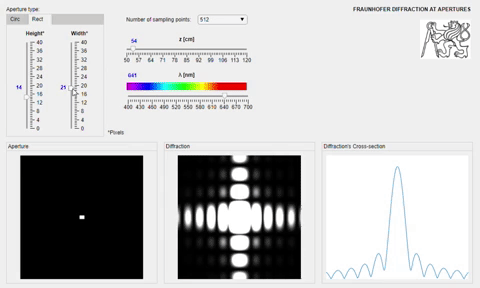
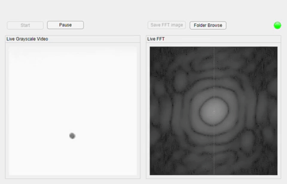
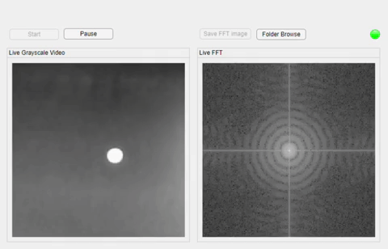
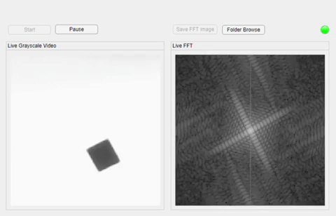
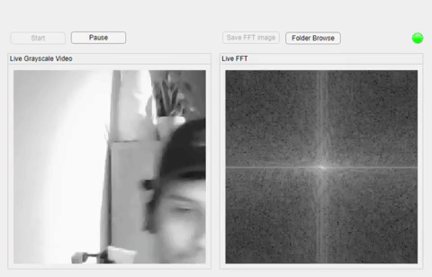

## SpatialFilter

The simulations shown here in the Diffraction and the Live FFT are merely illustrative to give a brief introduction
of to what the main User Interface for Automatic Adjust Spatial Filter app will do. At the end this UI should be found
in the main folder. This UI is being developed to analyze the output beam pattern of a laser source of light passing 
through a pinhole and then being projected at a plane, such pattern is then captured by a camera which sends the image 
information to be used during Image processing in MATLAB with to later on generate the right commands of X and Y motions
to the piezo drive in which the pinhole is fixed. The displacement of the aperture hole will result in a new different
output beam pattern that is again analyzed by the program, the automated motion in X and Y axes is said to be complete
once the output beam pattern shows perfectly symmetric Airy disk pattern. It is then when the motion in the Z direction
(objective's motion) starts taking place, with the aim of now adjust the objective's lens at an exact distance of its
length from the objective, this will result in a perfect circular output beam patter without diffraction rings.

# Diffraction

Fraunhofer's diffraction simulation app. 

 
   

 
   

# Example of FFT
Here is four examples of the FFT2 function applied to live stream video (single frames individually), showing different shapes representing different aperture shapes such as circular and squared. 

 
   
   

  
  

